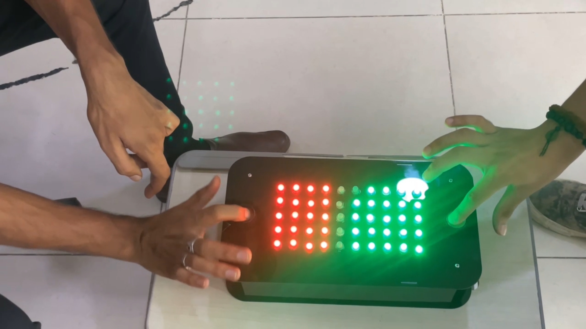
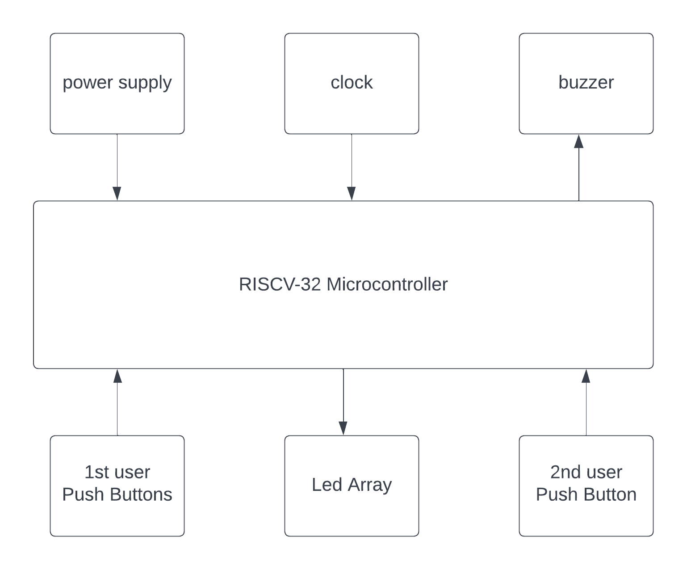
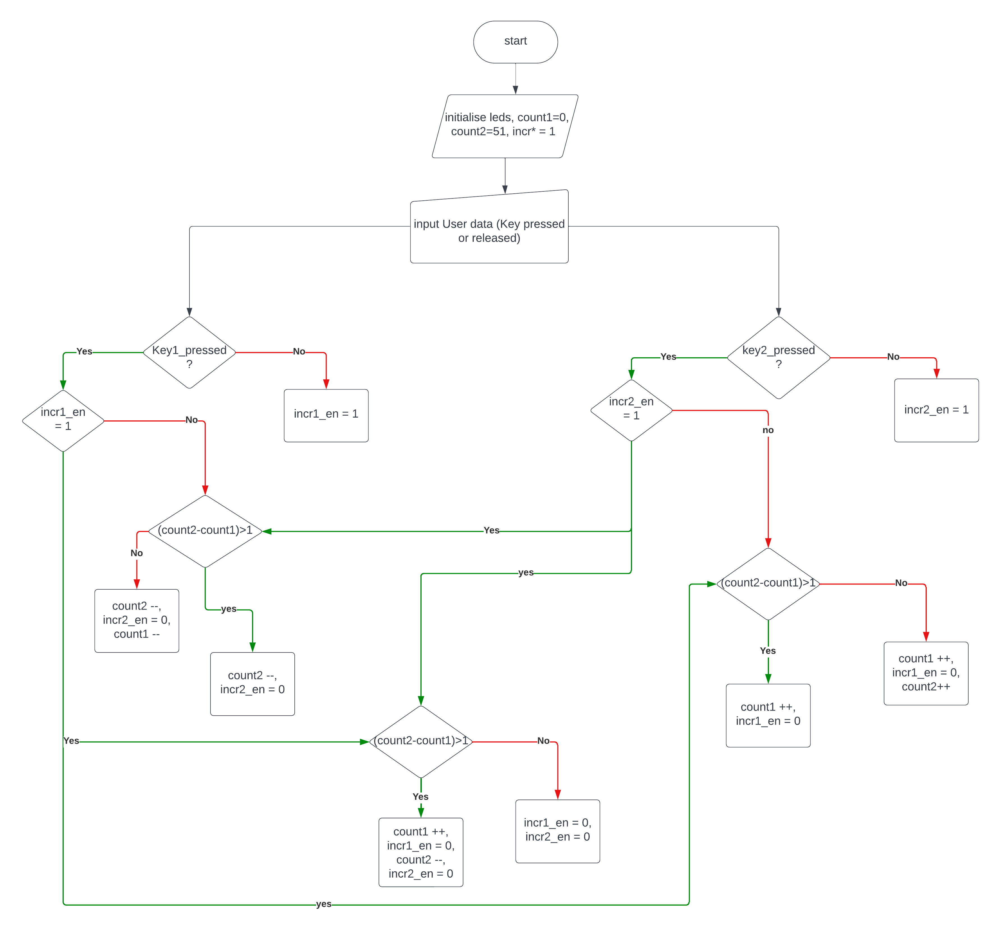
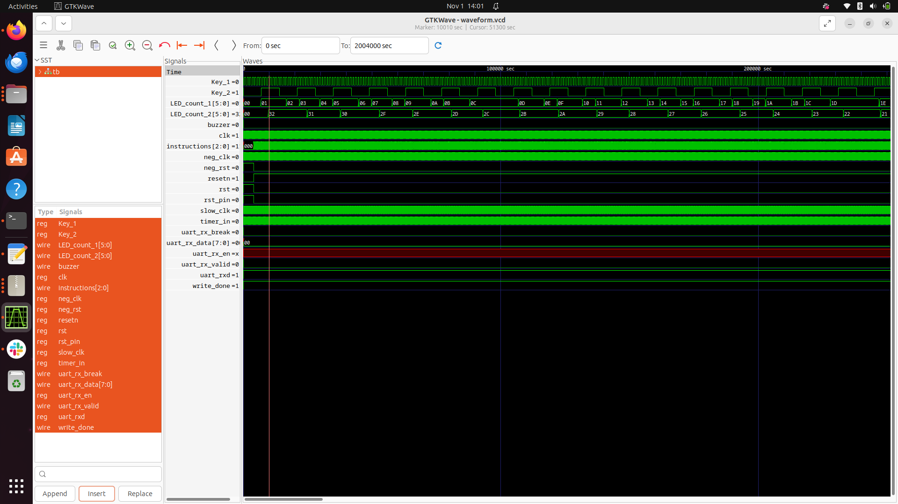
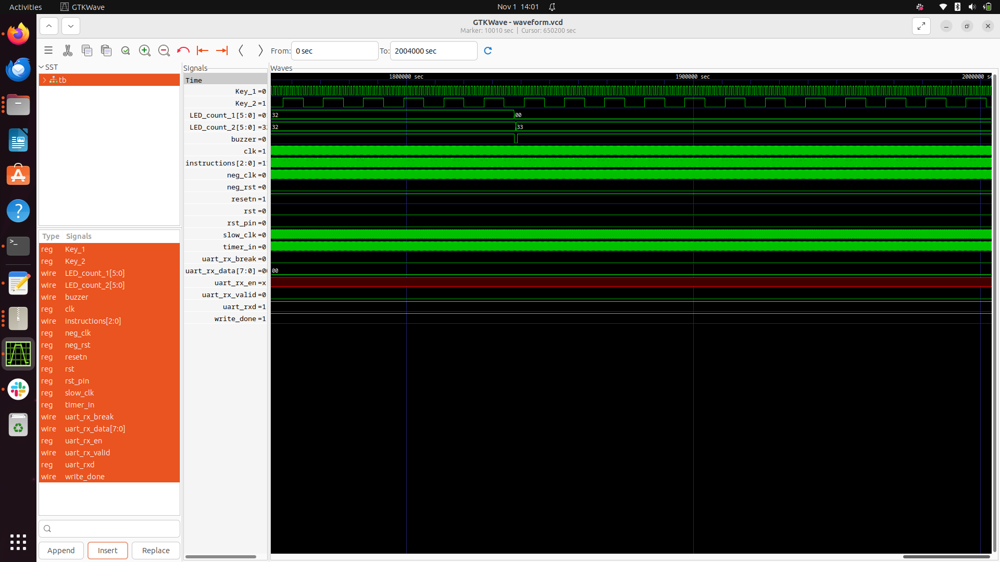

# RISCV_ASIC_2_player_arcade_game

### RISCV GNU tool chain

RISCV GNU tool chain is a C & C++ cross compiler. It has two modes: ELF/Newlib toolchain and Linux-ELF/glibc toolchain. We are using ELF/Newlib toolchain.

We are building a custom RISCV based application core for a specific application for 32 bit processor. 

Following are tools required to compile & execute the application:

1. RISCV GNU toolchain with dependent libraries as specified in [RISCV-GNU-Toolchain](https://github.com/riscv-collab/riscv-gnu-toolchain).

2. Spike simulator - Spike is a functional RISC-V ISA simulator that implements a functional model of one or more RISC-V harts. [RISCV-SPIKE](https://github.com/riscv-software-src/riscv-isa-sim.git).

### RISCV 32 bit compiler installation.

```
sudo apt install libc6-dev
git clone https://github.com/riscv/riscv-gnu-toolchain --recursive
mkdir riscv32-toolchain
cd riscv-gnu-toolchain
./configure --prefix=/home/ammula-shiva-kumar/riscv32-toolchain/ --with-arch=rv32i --with-abi=ilp32
sudo apt-get install libgmp-dev
make
```

Access the riscv32-unknown-elf-gcc inside bin folder of riscv32-toolchain folder in home folder of user as shown.

```
/home/ammula-shiva-kumar/riscv32-toolchain/bin/riscv32-unknown-elf-gcc --version

```

### 2 Player Arcade Game



**Description**
2 Player Arcade game is a physically interactive fun game where people will play very enthusiastically. here as shown in the above figure the game contains "10x5" led matrix and two push buttions where each user uses a push button to continuously press to increase the number of led's of the user colour.when the green and the red leds meet they collide and the upper hand here between the two colours is the  user colour that came in first. Finally the user who has more rate of pressing the push button, will have all the leds lit up with the user colour and the user wins. There will be a buzzer sound to indicate that the game has ended and the new game has started

### Block Diagram



### Functionality -

- In this architecture the microcontroller samples the user input on every loop and checks weather the user input status(pressed or released) is changed or not . 1 will be transmitted if button is pressed and 0 is transmitted if button is released.
- In the middle of the loop if the status of the button changes from '0' to '1' then led count value of that particular user is incremented.
- If the push bution status stays constant then no change is done on the led count variables.
- Here a variable incr_en is used to signify that the push buttion status is changed and you can increment the user count variable.
- The above mentioned logic is mandatory to ensure that every time user presses the key once only one led is incremented.
- When both leds collide led count variables are incremented or decremented based on which user input is given respectively.
- here led counts are initialised with 0 and 51 for user 1 and 2 respectively.
- if user 1 presses the button then count 1 is incremented and if user 2 presses the key then count 2 is decremented .
- the user with all the leds as the same user colour wins.
- A buzzer sound is provided which beeps three times with a second delay each to indicate that the previous game has ended and new game starts after the 3 beeps so users should get ready to play in the mean time.
  
### Flow Chart



here each time the led count variable is incremented/decremented it checks weather count2 > 0 and count1 <51 and increments/decrements the count variable.If any condition is not satisified then the user wins and the buzzer function is called.the buzzer function uses the delay input from the 555 timer to make 1 second delay with counter and turns on the buzzeer 3 times with a second delay in middle. after beeping 3 times it initialises the count variables again and returns the function to main.

### debugging

```
#include<stdio.h>

//unsigned int input_key(unsigned int key);
//void buzzer(unsigned int state);
void delay(unsigned int delay_ms);
//void display(unsigned int count_1, unsigned int count_2);

int main(void)
{
	
        unsigned int incr1_en = 1 ;
	unsigned int incr2_en = 1 ;
	unsigned int key_1, key_2 ;
	unsigned int count_1 = 0 ;
	unsigned int count_2 = 51 ;
	unsigned int i ;

	for(i = 1; i<= 120; i++)
	{

		//printf("enter user keys\n ") ;          //used for debugging in windows
		//scanf("%d",&key_1);
		//scanf("%d",&key_2);
		//key_1 = input_key(1);
		//key_2 = input_key(2);

		if(i%2 == 0)
		 {
			key_1 = 0 ;      //input user key pressing rate = 50%
		 }
		else
		{
			key_1 = 1 ;
		}
		if(i%5 == 0)           ////input user key pressing rate = 20%
		 {
			key_2 = 0 ;
		 }
		else
		{
			key_2 = 1 ;
		}
                printf("Input_Key_1 = %d ,  Input_Key_2 = %d \n ", key_1, key_2 ) ;
	
		if((key_1 > 0)&&(key_2 > 0))
		{
			if((incr1_en ==1)&&(incr2_en == 1))
			{
				if((count_2 - count_1)>1)
				{
					count_2 = count_2 - 1 ;
					incr2_en = 0 ;
					count_1 = count_1 + 1 ;
					incr1_en = 0 ;
				}
				else
				{
					incr1_en = 0 ;
					incr2_en = 0 ;
				}
			}
			else if((incr1_en ==0)&&(incr2_en == 1))
			{
				if((count_2 - count_1)>1)
				{
					count_2 = count_2 - 1 ;
					incr2_en = 0 ;
				}
				else
				{
					count_2 = count_2 - 1 ;
                    incr2_en = 0 ;
					count_1 = count_1 - 1 ;
				}
			}
			else if((incr1_en ==1)&&(incr2_en == 0))
			{
				if((count_2 - count_1)>1)
				{
					count_1 = count_1 +1 ;
					incr1_en = 0 ;
				}
				else
				{
					count_1 = count_1 + 1 ;
					incr1_en = 0 ;
					count_2 = count_2 + 1 ;
				}
			}
			

	
		}
		else if((key_1 > 0)&&(key_2==0))
		{
			incr2_en = 1 ;
			if(incr1_en)
			{
	        	if((count_2 - count_1)>1)
                {
                    count_1 = count_1 +1 ;
                    incr1_en = 0 ;
            	}
          	  	else
           		{
        	       	count_1 = count_1 + 1 ;
                	incr1_en = 0 ;
                 	count_2 = count_2 + 1 ;
            	}
			}	


		}
		else if((key_1==0)&&(key_2 > 0))
		{
			incr1_en = 1 ;
			if(incr2_en)
        	{
                if((count_2 - count_1)>1)
                {
        	        count_2 = count_2 - 1 ;
    	   	        incr2_en = 0 ;
          		}
            	else
          		{
                	count_2 = count_2 - 1 ;
                  	incr2_en = 0 ;
                  	count_1 = count_1 - 1 ;
               	}
        	}

		}
		else
		{
			incr1_en = 1 ;
			incr2_en = 1 ;
		}
		if((count_1 > 50) | (count_2 < 1) )
		{       //buzzer(1);          //first beep indicates the game is ended the leds get halted for 1.5 sec. and resetted to 0
		        printf("buzzer is on\n");
			delay(500);
			//buzzer(0);
			printf("#500 buzzer is off\n");
			delay(1000);
			count_1 = 0 ;
			count_2 = 51 ;
			//display(count_1, count_2);
			printf("LED_count_1 = %d ,LED_count_2 = %d \n ", count_1, count_2 ) ;

			//buzzer(1);          //beep sound for 3 times for every 1 sec.
			printf("#1000 buzzer is on\n");
			delay(400);
			//buzzer(0);
			printf("#400 buzzer is off\n");
			delay(600);

			//buzzer(1);
			printf("#600 buzzer is on\n");
			delay(400);
			//buzzer(0);
			printf("#400 buzzer is off\n");
			delay(600);

			//buzzer(1);
			printf("#600 buzzer is on\n");
			delay(400);
			//buzzer(0);
			printf("#400 buzzer is off\n");
			delay(600);
  


		}
		//display(count_1, count_2) ;          //after every iteration the display is updated.
      	printf("LED_count_1 = %d ,     LED_count_2 = %d \n ", count_1, count_2 ) ;           // used for debugging in windows
		printf("-------------------------------------------------------------------------\n") ;

	}
	return (0);
	
}
// debugging all the outputs are taken in console and inputs are given through program
//commented
/*unsigned int input_key(unsigned int key)
{
	 int temp = key*16;               //key_1 = bit-4 , key_2 = bit-5
            asm(
			"addi x29,x30,0"          // copy x30 to x29
            "and %0,x29, %1\n\t"     // take the key value from specified bit
            :"=r"(value)
            :"r"(temp)
        );
		return temp;
} */

/*void buzzer(unsigned int state)
{
	int temp = state *4 ;    //buzzer output 2nd bit of x30 reg.
		asm(
			"or x30 , x30, %0"
			:  :"r"(temp)
		);
}*/

void delay(unsigned int delay_ms)
{
	int counter = 0;
	int timer_inp ;             //555 timer input bit 6 of x30
	int temp = 0 ;
	/*while(1)
	{
		asm(
			"addi x29, x30, 0"
			"and %0 , x29, 64"
			:"=r"(timer_inp)
		);

		if(temp != timer_inp)
		{
			temp = timer_inp;
			counter = counter +1 ;
		}
		if(delay_ms == counter)
		{
			break;
		}
	} */
}

/*void display(unsigned int count_1, unsigned int count_2)
{
	int temp1, temp2 ;
	int rem1, rem2 ;      // rows = 10, column = 5 ;
	int row = 1 , column = 1 ;
	int count1_dec = 1, count2_dec = 1;

	temp1 = count_1/5 ;
	temp2 = count_2/5 ;
	rem1 = count_1 % 5 ;
	rem2 = count_2 % 5 ;
	for(i= 0; i<= count_1; i++)
	{
		count1_dec = 2*count1_dec ;
	}
	for(row = 1; row < ; row*2)
	{
		column = 5 ;
		//output(row, column);
		delay(1);
	}
	row = count_1 +1 ;
	column = rem1 ;


} */


```


### simulation commands used and the result are as follows :
```
ammula-shiva-kumar@ammula-shiva-kumar-HP-Laptop-15-da1xxx:~$ riscv64-unknown-elf-gcc -march=rv64i -mabi=lp64 -ffreestanding -o out arcadespike1.c
ammula-shiva-kumar@ammula-shiva-kumar-HP-Laptop-15-da1xxx:~$ spike pk out
bbl loader
Input_Key_1 = 1 ,  Input_Key_2 = 1 
 LED_count_1 = 1 ,     LED_count_2 = 50 
 -------------------------------------------------------------------------
Input_Key_1 = 0 ,  Input_Key_2 = 1 
 LED_count_1 = 1 ,     LED_count_2 = 50 
 -------------------------------------------------------------------------
Input_Key_1 = 1 ,  Input_Key_2 = 1 
 LED_count_1 = 2 ,     LED_count_2 = 50 
 -------------------------------------------------------------------------
Input_Key_1 = 0 ,  Input_Key_2 = 1 
 LED_count_1 = 2 ,     LED_count_2 = 50 
 -------------------------------------------------------------------------
Input_Key_1 = 1 ,  Input_Key_2 = 0 
 LED_count_1 = 3 ,     LED_count_2 = 50 
 -------------------------------------------------------------------------
Input_Key_1 = 0 ,  Input_Key_2 = 1 
 LED_count_1 = 3 ,     LED_count_2 = 49 
 -------------------------------------------------------------------------
Input_Key_1 = 1 ,  Input_Key_2 = 1 
 LED_count_1 = 4 ,     LED_count_2 = 49 
 -------------------------------------------------------------------------
Input_Key_1 = 0 ,  Input_Key_2 = 1 
 LED_count_1 = 4 ,     LED_count_2 = 49 
 -------------------------------------------------------------------------
Input_Key_1 = 1 ,  Input_Key_2 = 1 
 LED_count_1 = 5 ,     LED_count_2 = 49 
 -------------------------------------------------------------------------
Input_Key_1 = 0 ,  Input_Key_2 = 0 
 LED_count_1 = 5 ,     LED_count_2 = 49 
 -------------------------------------------------------------------------
Input_Key_1 = 1 ,  Input_Key_2 = 1 
 LED_count_1 = 6 ,     LED_count_2 = 48 
 -------------------------------------------------------------------------
Input_Key_1 = 0 ,  Input_Key_2 = 1 
 LED_count_1 = 6 ,     LED_count_2 = 48 
 -------------------------------------------------------------------------
Input_Key_1 = 1 ,  Input_Key_2 = 1 
 LED_count_1 = 7 ,     LED_count_2 = 48 
 -------------------------------------------------------------------------
Input_Key_1 = 0 ,  Input_Key_2 = 1 
 LED_count_1 = 7 ,     LED_count_2 = 48 
 -------------------------------------------------------------------------
Input_Key_1 = 1 ,  Input_Key_2 = 0 
 LED_count_1 = 8 ,     LED_count_2 = 48 
 -------------------------------------------------------------------------
Input_Key_1 = 0 ,  Input_Key_2 = 1 
 LED_count_1 = 8 ,     LED_count_2 = 47 
 -------------------------------------------------------------------------
Input_Key_1 = 1 ,  Input_Key_2 = 1 
 LED_count_1 = 9 ,     LED_count_2 = 47 
 -------------------------------------------------------------------------
Input_Key_1 = 0 ,  Input_Key_2 = 1 
 LED_count_1 = 9 ,     LED_count_2 = 47 
 -------------------------------------------------------------------------
Input_Key_1 = 1 ,  Input_Key_2 = 1 
 LED_count_1 = 10 ,     LED_count_2 = 47 
 -------------------------------------------------------------------------
Input_Key_1 = 0 ,  Input_Key_2 = 0 
 LED_count_1 = 10 ,     LED_count_2 = 47 
 -------------------------------------------------------------------------
Input_Key_1 = 1 ,  Input_Key_2 = 1 
 LED_count_1 = 11 ,     LED_count_2 = 46 
 -------------------------------------------------------------------------
Input_Key_1 = 0 ,  Input_Key_2 = 1 
 LED_count_1 = 11 ,     LED_count_2 = 46 
 -------------------------------------------------------------------------
Input_Key_1 = 1 ,  Input_Key_2 = 1 
 LED_count_1 = 12 ,     LED_count_2 = 46 
 -------------------------------------------------------------------------
Input_Key_1 = 0 ,  Input_Key_2 = 1 
 LED_count_1 = 12 ,     LED_count_2 = 46 
 -------------------------------------------------------------------------
Input_Key_1 = 1 ,  Input_Key_2 = 0 
 LED_count_1 = 13 ,     LED_count_2 = 46 
 -------------------------------------------------------------------------
Input_Key_1 = 0 ,  Input_Key_2 = 1 
 LED_count_1 = 13 ,     LED_count_2 = 45 
 -------------------------------------------------------------------------
Input_Key_1 = 1 ,  Input_Key_2 = 1 
 LED_count_1 = 14 ,     LED_count_2 = 45 
 -------------------------------------------------------------------------
Input_Key_1 = 0 ,  Input_Key_2 = 1 
 LED_count_1 = 14 ,     LED_count_2 = 45 
 -------------------------------------------------------------------------
Input_Key_1 = 1 ,  Input_Key_2 = 1 
 LED_count_1 = 15 ,     LED_count_2 = 45 
 -------------------------------------------------------------------------
Input_Key_1 = 0 ,  Input_Key_2 = 0 
 LED_count_1 = 15 ,     LED_count_2 = 45 
 -------------------------------------------------------------------------
Input_Key_1 = 1 ,  Input_Key_2 = 1 
 LED_count_1 = 16 ,     LED_count_2 = 44 
 -------------------------------------------------------------------------
Input_Key_1 = 0 ,  Input_Key_2 = 1 
 LED_count_1 = 16 ,     LED_count_2 = 44 
 -------------------------------------------------------------------------
Input_Key_1 = 1 ,  Input_Key_2 = 1 
 LED_count_1 = 17 ,     LED_count_2 = 44 
 -------------------------------------------------------------------------
Input_Key_1 = 0 ,  Input_Key_2 = 1 
 LED_count_1 = 17 ,     LED_count_2 = 44 
 -------------------------------------------------------------------------
Input_Key_1 = 1 ,  Input_Key_2 = 0 
 LED_count_1 = 18 ,     LED_count_2 = 44 
 -------------------------------------------------------------------------
Input_Key_1 = 0 ,  Input_Key_2 = 1 
 LED_count_1 = 18 ,     LED_count_2 = 43 
 -------------------------------------------------------------------------
Input_Key_1 = 1 ,  Input_Key_2 = 1 
 LED_count_1 = 19 ,     LED_count_2 = 43 
 -------------------------------------------------------------------------
Input_Key_1 = 0 ,  Input_Key_2 = 1 
 LED_count_1 = 19 ,     LED_count_2 = 43 
 -------------------------------------------------------------------------
Input_Key_1 = 1 ,  Input_Key_2 = 1 
 LED_count_1 = 20 ,     LED_count_2 = 43 
 -------------------------------------------------------------------------
Input_Key_1 = 0 ,  Input_Key_2 = 0 
 LED_count_1 = 20 ,     LED_count_2 = 43 
 -------------------------------------------------------------------------
Input_Key_1 = 1 ,  Input_Key_2 = 1 
 LED_count_1 = 21 ,     LED_count_2 = 42 
 -------------------------------------------------------------------------
Input_Key_1 = 0 ,  Input_Key_2 = 1 
 LED_count_1 = 21 ,     LED_count_2 = 42 
 -------------------------------------------------------------------------
Input_Key_1 = 1 ,  Input_Key_2 = 1 
 LED_count_1 = 22 ,     LED_count_2 = 42 
 -------------------------------------------------------------------------
Input_Key_1 = 0 ,  Input_Key_2 = 1 
 LED_count_1 = 22 ,     LED_count_2 = 42 
 -------------------------------------------------------------------------
Input_Key_1 = 1 ,  Input_Key_2 = 0 
 LED_count_1 = 23 ,     LED_count_2 = 42 
 -------------------------------------------------------------------------
Input_Key_1 = 0 ,  Input_Key_2 = 1 
 LED_count_1 = 23 ,     LED_count_2 = 41 
 -------------------------------------------------------------------------
Input_Key_1 = 1 ,  Input_Key_2 = 1 
 LED_count_1 = 24 ,     LED_count_2 = 41 
 -------------------------------------------------------------------------
Input_Key_1 = 0 ,  Input_Key_2 = 1 
 LED_count_1 = 24 ,     LED_count_2 = 41 
 -------------------------------------------------------------------------
Input_Key_1 = 1 ,  Input_Key_2 = 1 
 LED_count_1 = 25 ,     LED_count_2 = 41 
 -------------------------------------------------------------------------
Input_Key_1 = 0 ,  Input_Key_2 = 0 
 LED_count_1 = 25 ,     LED_count_2 = 41 
 -------------------------------------------------------------------------
Input_Key_1 = 1 ,  Input_Key_2 = 1 
 LED_count_1 = 26 ,     LED_count_2 = 40 
 -------------------------------------------------------------------------
Input_Key_1 = 0 ,  Input_Key_2 = 1 
 LED_count_1 = 26 ,     LED_count_2 = 40 
 -------------------------------------------------------------------------
Input_Key_1 = 1 ,  Input_Key_2 = 1 
 LED_count_1 = 27 ,     LED_count_2 = 40 
 -------------------------------------------------------------------------
Input_Key_1 = 0 ,  Input_Key_2 = 1 
 LED_count_1 = 27 ,     LED_count_2 = 40 
 -------------------------------------------------------------------------
Input_Key_1 = 1 ,  Input_Key_2 = 0 
 LED_count_1 = 28 ,     LED_count_2 = 40 
 -------------------------------------------------------------------------
Input_Key_1 = 0 ,  Input_Key_2 = 1 
 LED_count_1 = 28 ,     LED_count_2 = 39 
 -------------------------------------------------------------------------
Input_Key_1 = 1 ,  Input_Key_2 = 1 
 LED_count_1 = 29 ,     LED_count_2 = 39 
 -------------------------------------------------------------------------
Input_Key_1 = 0 ,  Input_Key_2 = 1 
 LED_count_1 = 29 ,     LED_count_2 = 39 
 -------------------------------------------------------------------------
Input_Key_1 = 1 ,  Input_Key_2 = 1 
 LED_count_1 = 30 ,     LED_count_2 = 39 
 -------------------------------------------------------------------------
Input_Key_1 = 0 ,  Input_Key_2 = 0 
 LED_count_1 = 30 ,     LED_count_2 = 39 
 -------------------------------------------------------------------------
Input_Key_1 = 1 ,  Input_Key_2 = 1 
 LED_count_1 = 31 ,     LED_count_2 = 38 
 -------------------------------------------------------------------------
Input_Key_1 = 0 ,  Input_Key_2 = 1 
 LED_count_1 = 31 ,     LED_count_2 = 38 
 -------------------------------------------------------------------------
Input_Key_1 = 1 ,  Input_Key_2 = 1 
 LED_count_1 = 32 ,     LED_count_2 = 38 
 -------------------------------------------------------------------------
Input_Key_1 = 0 ,  Input_Key_2 = 1 
 LED_count_1 = 32 ,     LED_count_2 = 38 
 -------------------------------------------------------------------------
Input_Key_1 = 1 ,  Input_Key_2 = 0 
 LED_count_1 = 33 ,     LED_count_2 = 38 
 -------------------------------------------------------------------------
Input_Key_1 = 0 ,  Input_Key_2 = 1 
 LED_count_1 = 33 ,     LED_count_2 = 37 
 -------------------------------------------------------------------------
Input_Key_1 = 1 ,  Input_Key_2 = 1 
 LED_count_1 = 34 ,     LED_count_2 = 37 
 -------------------------------------------------------------------------
Input_Key_1 = 0 ,  Input_Key_2 = 1 
 LED_count_1 = 34 ,     LED_count_2 = 37 
 -------------------------------------------------------------------------
Input_Key_1 = 1 ,  Input_Key_2 = 1 
 LED_count_1 = 35 ,     LED_count_2 = 37 
 -------------------------------------------------------------------------
Input_Key_1 = 0 ,  Input_Key_2 = 0 
 LED_count_1 = 35 ,     LED_count_2 = 37 
 -------------------------------------------------------------------------
Input_Key_1 = 1 ,  Input_Key_2 = 1 
 LED_count_1 = 36 ,     LED_count_2 = 36 
 -------------------------------------------------------------------------
Input_Key_1 = 0 ,  Input_Key_2 = 1 
 LED_count_1 = 36 ,     LED_count_2 = 36 
 -------------------------------------------------------------------------
Input_Key_1 = 1 ,  Input_Key_2 = 1 
 LED_count_1 = 37 ,     LED_count_2 = 37 
 -------------------------------------------------------------------------
Input_Key_1 = 0 ,  Input_Key_2 = 1 
 LED_count_1 = 37 ,     LED_count_2 = 37 
 -------------------------------------------------------------------------
Input_Key_1 = 1 ,  Input_Key_2 = 0 
 LED_count_1 = 38 ,     LED_count_2 = 38 
 -------------------------------------------------------------------------
Input_Key_1 = 0 ,  Input_Key_2 = 1 
 LED_count_1 = 37 ,     LED_count_2 = 37 
 -------------------------------------------------------------------------
Input_Key_1 = 1 ,  Input_Key_2 = 1 
 LED_count_1 = 38 ,     LED_count_2 = 38 
 -------------------------------------------------------------------------
Input_Key_1 = 0 ,  Input_Key_2 = 1 
 LED_count_1 = 38 ,     LED_count_2 = 38 
 -------------------------------------------------------------------------
Input_Key_1 = 1 ,  Input_Key_2 = 1 
 LED_count_1 = 39 ,     LED_count_2 = 39 
 -------------------------------------------------------------------------
Input_Key_1 = 0 ,  Input_Key_2 = 0 
 LED_count_1 = 39 ,     LED_count_2 = 39 
 -------------------------------------------------------------------------
Input_Key_1 = 1 ,  Input_Key_2 = 1 
 LED_count_1 = 39 ,     LED_count_2 = 39 
 -------------------------------------------------------------------------
Input_Key_1 = 0 ,  Input_Key_2 = 1 
 LED_count_1 = 39 ,     LED_count_2 = 39 
 -------------------------------------------------------------------------
Input_Key_1 = 1 ,  Input_Key_2 = 1 
 LED_count_1 = 40 ,     LED_count_2 = 40 
 -------------------------------------------------------------------------
Input_Key_1 = 0 ,  Input_Key_2 = 1 
 LED_count_1 = 40 ,     LED_count_2 = 40 
 -------------------------------------------------------------------------
Input_Key_1 = 1 ,  Input_Key_2 = 0 
 LED_count_1 = 41 ,     LED_count_2 = 41 
 -------------------------------------------------------------------------
Input_Key_1 = 0 ,  Input_Key_2 = 1 
 LED_count_1 = 40 ,     LED_count_2 = 40 
 -------------------------------------------------------------------------
Input_Key_1 = 1 ,  Input_Key_2 = 1 
 LED_count_1 = 41 ,     LED_count_2 = 41 
 -------------------------------------------------------------------------
Input_Key_1 = 0 ,  Input_Key_2 = 1 
 LED_count_1 = 41 ,     LED_count_2 = 41 
 -------------------------------------------------------------------------
Input_Key_1 = 1 ,  Input_Key_2 = 1 
 LED_count_1 = 42 ,     LED_count_2 = 42 
 -------------------------------------------------------------------------
Input_Key_1 = 0 ,  Input_Key_2 = 0 
 LED_count_1 = 42 ,     LED_count_2 = 42 
 -------------------------------------------------------------------------
Input_Key_1 = 1 ,  Input_Key_2 = 1 
 LED_count_1 = 42 ,     LED_count_2 = 42 
 -------------------------------------------------------------------------
Input_Key_1 = 0 ,  Input_Key_2 = 1 
 LED_count_1 = 42 ,     LED_count_2 = 42 
 -------------------------------------------------------------------------
Input_Key_1 = 1 ,  Input_Key_2 = 1 
 LED_count_1 = 43 ,     LED_count_2 = 43 
 -------------------------------------------------------------------------
Input_Key_1 = 0 ,  Input_Key_2 = 1 
 LED_count_1 = 43 ,     LED_count_2 = 43 
 -------------------------------------------------------------------------
Input_Key_1 = 1 ,  Input_Key_2 = 0 
 LED_count_1 = 44 ,     LED_count_2 = 44 
 -------------------------------------------------------------------------
Input_Key_1 = 0 ,  Input_Key_2 = 1 
 LED_count_1 = 43 ,     LED_count_2 = 43 
 -------------------------------------------------------------------------
Input_Key_1 = 1 ,  Input_Key_2 = 1 
 LED_count_1 = 44 ,     LED_count_2 = 44 
 -------------------------------------------------------------------------
Input_Key_1 = 0 ,  Input_Key_2 = 1 
 LED_count_1 = 44 ,     LED_count_2 = 44 
 -------------------------------------------------------------------------
Input_Key_1 = 1 ,  Input_Key_2 = 1 
 LED_count_1 = 45 ,     LED_count_2 = 45 
 -------------------------------------------------------------------------
Input_Key_1 = 0 ,  Input_Key_2 = 0 
 LED_count_1 = 45 ,     LED_count_2 = 45 
 -------------------------------------------------------------------------
Input_Key_1 = 1 ,  Input_Key_2 = 1 
 LED_count_1 = 45 ,     LED_count_2 = 45 
 -------------------------------------------------------------------------
Input_Key_1 = 0 ,  Input_Key_2 = 1 
 LED_count_1 = 45 ,     LED_count_2 = 45 
 -------------------------------------------------------------------------
Input_Key_1 = 1 ,  Input_Key_2 = 1 
 LED_count_1 = 46 ,     LED_count_2 = 46 
 -------------------------------------------------------------------------
Input_Key_1 = 0 ,  Input_Key_2 = 1 
 LED_count_1 = 46 ,     LED_count_2 = 46 
 -------------------------------------------------------------------------
Input_Key_1 = 1 ,  Input_Key_2 = 0 
 LED_count_1 = 47 ,     LED_count_2 = 47 
 -------------------------------------------------------------------------
Input_Key_1 = 0 ,  Input_Key_2 = 1 
 LED_count_1 = 46 ,     LED_count_2 = 46 
 -------------------------------------------------------------------------
Input_Key_1 = 1 ,  Input_Key_2 = 1 
 LED_count_1 = 47 ,     LED_count_2 = 47 
 -------------------------------------------------------------------------
Input_Key_1 = 0 ,  Input_Key_2 = 1 
 LED_count_1 = 47 ,     LED_count_2 = 47 
 -------------------------------------------------------------------------
Input_Key_1 = 1 ,  Input_Key_2 = 1 
 LED_count_1 = 48 ,     LED_count_2 = 48 
 -------------------------------------------------------------------------
Input_Key_1 = 0 ,  Input_Key_2 = 0 
 LED_count_1 = 48 ,     LED_count_2 = 48 
 -------------------------------------------------------------------------
Input_Key_1 = 1 ,  Input_Key_2 = 1 
 LED_count_1 = 48 ,     LED_count_2 = 48 
 -------------------------------------------------------------------------
Input_Key_1 = 0 ,  Input_Key_2 = 1 
 LED_count_1 = 48 ,     LED_count_2 = 48 
 -------------------------------------------------------------------------
Input_Key_1 = 1 ,  Input_Key_2 = 1 
 LED_count_1 = 49 ,     LED_count_2 = 49 
 -------------------------------------------------------------------------
Input_Key_1 = 0 ,  Input_Key_2 = 1 
 LED_count_1 = 49 ,     LED_count_2 = 49 
 -------------------------------------------------------------------------
Input_Key_1 = 1 ,  Input_Key_2 = 0 
 LED_count_1 = 50 ,     LED_count_2 = 50 
 -------------------------------------------------------------------------
Input_Key_1 = 0 ,  Input_Key_2 = 1 
 LED_count_1 = 49 ,     LED_count_2 = 49 
 -------------------------------------------------------------------------
Input_Key_1 = 1 ,  Input_Key_2 = 1 
 LED_count_1 = 50 ,     LED_count_2 = 50 
 -------------------------------------------------------------------------
Input_Key_1 = 0 ,  Input_Key_2 = 1 
 LED_count_1 = 50 ,     LED_count_2 = 50 
 -------------------------------------------------------------------------
Input_Key_1 = 1 ,  Input_Key_2 = 1 
 buzzer is on                    //game has ended
#500 buzzer is off
LED_count_1 = 0 ,LED_count_2 = 51    //led display refreshed
 #1000 buzzer is on            // 3 beep soundsin 3 seconds to indicate the start of the game
#400 buzzer is off
#600 buzzer is on
#400 buzzer is off
#600 buzzer is on
#400 buzzer is off
LED_count_1 = 0 ,     LED_count_2 = 51 //new game started again
 -------------------------------------------------------------------------
Input_Key_1 = 0 ,  Input_Key_2 = 0 
 LED_count_1 = 0 ,     LED_count_2 = 51              // for loop ended
 -------------------------------------------------------------------------
ammula-shiva-kumar@ammula-shiva-kumar-HP-Laptop-15-da1xxx:~$ 

```
In the simulation here input_key_1 and input_key_2 keys are the user inputs respectively . Here, in the code the inputs are given such that the input_key_1 rate of pressing the key is more than the input_key_2, so the user 1 should win .When the LED_count_1 = 50 or LED_count_2 = 0 game ends . here LED_count_1 = 50 so the user 1 has won.now the buzzer is turned on for 500ms and the LED_counter values are resetted to new game, after 1000ms 3 times buzzer is turned on and off with 1000ms as time period to indicate that the new game is gonna start and user needs to be get ready in 3 seconds. 
### code

```
//#include<stdio.h>

unsigned int input_key(unsigned int key);
void buzzer(unsigned int state);
void delay(unsigned int delay_ms);
void display(unsigned int count_1, unsigned int count_2);

int main(void)
{
	unsigned int incr1_en = 1 ;
	unsigned int incr2_en = 1 ;
	unsigned int key_1, key_2 ;
	unsigned int count_1 = 0 ;
	unsigned int count_2 = 51 ;


	while(1)
	{

		//printf("enter user keys\n ") ;          //used for debugging in windows
		//scanf("%d",&key_1);
		//scanf("%d",&key_2);
		key_1 = input_key(1);
		key_2 = input_key(2);

	
		if((key_1 > 0)&&(key_2 > 0))
		{
			if((incr1_en ==1)&&(incr2_en == 1))
			{
				if((count_2 - count_1)>1)
				{
					count_2 = count_2 - 1 ;
					incr2_en = 0 ;
					count_1 = count_1 + 1 ;
					incr1_en = 0 ;
				}
				else
				{
					incr1_en = 0 ;
					incr2_en = 0 ;
				}
			}
			else if((incr1_en ==0)&&(incr2_en == 1))
			{
				if((count_2 - count_1)>1)
				{
					count_2 = count_2 - 1 ;
					incr2_en = 0 ;
				}
				else
				{
					count_2 = count_2 - 1 ;
                    incr2_en = 0 ;
					count_1 = count_1 - 1 ;
				}
			}
			else if((incr1_en ==1)&&(incr2_en == 0))
			{
				if((count_2 - count_1)>1)
				{
					count_1 = count_1 +1 ;
					incr1_en = 0 ;
				}
				else
				{
					count_1 = count_1 + 1 ;
					incr1_en = 0 ;
					count_2 = count_2 + 1 ;
				}
			}
			

	
		}
		else if((key_1 > 0)&&(key_2==0))
		{
			incr2_en = 1 ;
			if(incr1_en)
			{
	        	if((count_2 - count_1)>1)
                {
                    count_1 = count_1 +1 ;
                    incr1_en = 0 ;
            	}
          	  	else
           		{
        	       	count_1 = count_1 + 1 ;
                	incr1_en = 0 ;
                 	count_2 = count_2 + 1 ;
            	}
			}	


		}
		else if((key_1==0)&&(key_2 > 0))
		{
			incr1_en = 1 ;
			if(incr2_en)
        	{
                if((count_2 - count_1)>1)
                {
        	        count_2 = count_2 - 1 ;
    	   	        incr2_en = 0 ;
          		}
            	else
          		{
                	count_2 = count_2 - 1 ;
                  	incr2_en = 0 ;
                  	count_1 = count_1 - 1 ;
               	}
        	}

		}
		else
		{
			incr1_en = 1 ;
			incr2_en = 1 ;
		}
		if((count_1 > 50) | (count_2 < 1) )
		{   buzzer(1);          //first beep indicates the game is ended the leds get halted for 1.5 sec. and resetted to 0
			delay(500);
			buzzer(0);
			delay(1000);
			count_1 = 0 ;
			count_2 = 51 ;
			display(count_1, count_2);

			buzzer(1);          //beep sound for 3 times for every 1 sec.
			delay(400);
			buzzer(0);
			delay(600);

			buzzer(1);
			delay(400);
			buzzer(0);
			delay(600);

			buzzer(1);
			delay(400);
			buzzer(0);
			delay(600);


		}
		display(count_1, count_2) ;          //after every iteration the display is updated.
      	//printf("count_1 = %d ,count_2 = %d \n ", count_1, count_2 ) ;           // used for debugging in windows

	}
	return (0);
	
}

unsigned int input_key(unsigned int key)
{
	 int temp = key*16;
         unsigned int out_key ;                     //key_1 = bit-4 , key_2 = bit-5
            asm(
			"addi x29,x30,0\n"          // copy x30 to x29
            "and %0,x29, %1\n\t"     // take the key value from specified bit
            :"=r"(out_key)
            :"r"(temp)
        );
		return out_key;
}

void buzzer(unsigned int state)
{
	int temp = state *4 ;    //buzzer output 2nd bit of x30 reg.
		asm(
			"or x30 , x30, %0"
			:  :"r"(temp)
		);
}

void delay(unsigned int delay_ms)
{
	int counter = 0;
	int timer_inp ;             //555 timer input bit 6 of x30
	int temp = 0 ;
	while(1)
	{
		asm(
			"addi x29, x30, 0\n"
			"and %0 , x29, 64"
			:"=r"(timer_inp)
		);

		if(temp != timer_inp)
		{
			temp = timer_inp;
			counter = counter +1 ;
		}
		if(delay_ms == counter)
		{
			break;
		}
	}
}

void display(unsigned int count_1, unsigned int count_2)
{

        int temp1 = count_1 * 1048576  ;    // display output bit-25 to bit-21 , 6-bits of x30 reg.
        int temp2 = count_2 * 67108864 ;    //  display output bit-31 to bit-26 , 6-bits of x30 reg.
		asm(
                        "or x30 , x30 , %1 \n "
			"or x30 , x30, %0 \n"
			:  :"r"(temp1), "r"(temp2)
		);

	
}  


```
### Assembly Code

```

out:     file format elf32-littleriscv


Disassembly of section .text:

00010054 <main>:
   10054:	fd010113          	addi	sp,sp,-48
   10058:	02112623          	sw	ra,44(sp)
   1005c:	02812423          	sw	s0,40(sp)
   10060:	03010413          	addi	s0,sp,48
   10064:	00100793          	li	a5,1
   10068:	fef42623          	sw	a5,-20(s0)
   1006c:	00100793          	li	a5,1
   10070:	fef42423          	sw	a5,-24(s0)
   10074:	fe042223          	sw	zero,-28(s0)
   10078:	03300793          	li	a5,51
   1007c:	fef42023          	sw	a5,-32(s0)
   10080:	00100513          	li	a0,1
   10084:	2f4000ef          	jal	ra,10378 <input_key>
   10088:	fca42e23          	sw	a0,-36(s0)
   1008c:	00200513          	li	a0,2
   10090:	2e8000ef          	jal	ra,10378 <input_key>
   10094:	fca42c23          	sw	a0,-40(s0)
   10098:	fdc42783          	lw	a5,-36(s0)
   1009c:	12078263          	beqz	a5,101c0 <main+0x16c>
   100a0:	fd842783          	lw	a5,-40(s0)
   100a4:	10078e63          	beqz	a5,101c0 <main+0x16c>
   100a8:	fec42703          	lw	a4,-20(s0)
   100ac:	00100793          	li	a5,1
   100b0:	04f71a63          	bne	a4,a5,10104 <main+0xb0>
   100b4:	fe842703          	lw	a4,-24(s0)
   100b8:	00100793          	li	a5,1
   100bc:	04f71463          	bne	a4,a5,10104 <main+0xb0>
   100c0:	fe042703          	lw	a4,-32(s0)
   100c4:	fe442783          	lw	a5,-28(s0)
   100c8:	40f70733          	sub	a4,a4,a5
   100cc:	00100793          	li	a5,1
   100d0:	02e7f463          	bgeu	a5,a4,100f8 <main+0xa4>
   100d4:	fe042783          	lw	a5,-32(s0)
   100d8:	fff78793          	addi	a5,a5,-1
   100dc:	fef42023          	sw	a5,-32(s0)
   100e0:	fe042423          	sw	zero,-24(s0)
   100e4:	fe442783          	lw	a5,-28(s0)
   100e8:	00178793          	addi	a5,a5,1
   100ec:	fef42223          	sw	a5,-28(s0)
   100f0:	fe042623          	sw	zero,-20(s0)
   100f4:	0c80006f          	j	101bc <main+0x168>
   100f8:	fe042623          	sw	zero,-20(s0)
   100fc:	fe042423          	sw	zero,-24(s0)
   10100:	0bc0006f          	j	101bc <main+0x168>
   10104:	fec42783          	lw	a5,-20(s0)
   10108:	04079c63          	bnez	a5,10160 <main+0x10c>
   1010c:	fe842703          	lw	a4,-24(s0)
   10110:	00100793          	li	a5,1
   10114:	04f71663          	bne	a4,a5,10160 <main+0x10c>
   10118:	fe042703          	lw	a4,-32(s0)
   1011c:	fe442783          	lw	a5,-28(s0)
   10120:	40f70733          	sub	a4,a4,a5
   10124:	00100793          	li	a5,1
   10128:	00e7fc63          	bgeu	a5,a4,10140 <main+0xec>
   1012c:	fe042783          	lw	a5,-32(s0)
   10130:	fff78793          	addi	a5,a5,-1
   10134:	fef42023          	sw	a5,-32(s0)
   10138:	fe042423          	sw	zero,-24(s0)
   1013c:	0800006f          	j	101bc <main+0x168>
   10140:	fe042783          	lw	a5,-32(s0)
   10144:	fff78793          	addi	a5,a5,-1
   10148:	fef42023          	sw	a5,-32(s0)
   1014c:	fe042423          	sw	zero,-24(s0)
   10150:	fe442783          	lw	a5,-28(s0)
   10154:	fff78793          	addi	a5,a5,-1
   10158:	fef42223          	sw	a5,-28(s0)
   1015c:	0600006f          	j	101bc <main+0x168>
   10160:	fec42703          	lw	a4,-20(s0)
   10164:	00100793          	li	a5,1
   10168:	12f71e63          	bne	a4,a5,102a4 <main+0x250>
   1016c:	fe842783          	lw	a5,-24(s0)
   10170:	12079a63          	bnez	a5,102a4 <main+0x250>
   10174:	fe042703          	lw	a4,-32(s0)
   10178:	fe442783          	lw	a5,-28(s0)
   1017c:	40f70733          	sub	a4,a4,a5
   10180:	00100793          	li	a5,1
   10184:	00e7fc63          	bgeu	a5,a4,1019c <main+0x148>
   10188:	fe442783          	lw	a5,-28(s0)
   1018c:	00178793          	addi	a5,a5,1
   10190:	fef42223          	sw	a5,-28(s0)
   10194:	fe042623          	sw	zero,-20(s0)
   10198:	10c0006f          	j	102a4 <main+0x250>
   1019c:	fe442783          	lw	a5,-28(s0)
   101a0:	00178793          	addi	a5,a5,1
   101a4:	fef42223          	sw	a5,-28(s0)
   101a8:	fe042623          	sw	zero,-20(s0)
   101ac:	fe042783          	lw	a5,-32(s0)
   101b0:	00178793          	addi	a5,a5,1
   101b4:	fef42023          	sw	a5,-32(s0)
   101b8:	0ec0006f          	j	102a4 <main+0x250>
   101bc:	0e80006f          	j	102a4 <main+0x250>
   101c0:	fdc42783          	lw	a5,-36(s0)
   101c4:	06078263          	beqz	a5,10228 <main+0x1d4>
   101c8:	fd842783          	lw	a5,-40(s0)
   101cc:	04079e63          	bnez	a5,10228 <main+0x1d4>
   101d0:	00100793          	li	a5,1
   101d4:	fef42423          	sw	a5,-24(s0)
   101d8:	fec42783          	lw	a5,-20(s0)
   101dc:	0c078663          	beqz	a5,102a8 <main+0x254>
   101e0:	fe042703          	lw	a4,-32(s0)
   101e4:	fe442783          	lw	a5,-28(s0)
   101e8:	40f70733          	sub	a4,a4,a5
   101ec:	00100793          	li	a5,1
   101f0:	00e7fc63          	bgeu	a5,a4,10208 <main+0x1b4>
   101f4:	fe442783          	lw	a5,-28(s0)
   101f8:	00178793          	addi	a5,a5,1
   101fc:	fef42223          	sw	a5,-28(s0)
   10200:	fe042623          	sw	zero,-20(s0)
   10204:	0a40006f          	j	102a8 <main+0x254>
   10208:	fe442783          	lw	a5,-28(s0)
   1020c:	00178793          	addi	a5,a5,1
   10210:	fef42223          	sw	a5,-28(s0)
   10214:	fe042623          	sw	zero,-20(s0)
   10218:	fe042783          	lw	a5,-32(s0)
   1021c:	00178793          	addi	a5,a5,1
   10220:	fef42023          	sw	a5,-32(s0)
   10224:	0840006f          	j	102a8 <main+0x254>
   10228:	fdc42783          	lw	a5,-36(s0)
   1022c:	06079263          	bnez	a5,10290 <main+0x23c>
   10230:	fd842783          	lw	a5,-40(s0)
   10234:	04078e63          	beqz	a5,10290 <main+0x23c>
   10238:	00100793          	li	a5,1
   1023c:	fef42623          	sw	a5,-20(s0)
   10240:	fe842783          	lw	a5,-24(s0)
   10244:	06078263          	beqz	a5,102a8 <main+0x254>
   10248:	fe042703          	lw	a4,-32(s0)
   1024c:	fe442783          	lw	a5,-28(s0)
   10250:	40f70733          	sub	a4,a4,a5
   10254:	00100793          	li	a5,1
   10258:	00e7fc63          	bgeu	a5,a4,10270 <main+0x21c>
   1025c:	fe042783          	lw	a5,-32(s0)
   10260:	fff78793          	addi	a5,a5,-1
   10264:	fef42023          	sw	a5,-32(s0)
   10268:	fe042423          	sw	zero,-24(s0)
   1026c:	03c0006f          	j	102a8 <main+0x254>
   10270:	fe042783          	lw	a5,-32(s0)
   10274:	fff78793          	addi	a5,a5,-1
   10278:	fef42023          	sw	a5,-32(s0)
   1027c:	fe042423          	sw	zero,-24(s0)
   10280:	fe442783          	lw	a5,-28(s0)
   10284:	fff78793          	addi	a5,a5,-1
   10288:	fef42223          	sw	a5,-28(s0)
   1028c:	01c0006f          	j	102a8 <main+0x254>
   10290:	00100793          	li	a5,1
   10294:	fef42623          	sw	a5,-20(s0)
   10298:	00100793          	li	a5,1
   1029c:	fef42423          	sw	a5,-24(s0)
   102a0:	0080006f          	j	102a8 <main+0x254>
   102a4:	00000013          	nop
   102a8:	fe442783          	lw	a5,-28(s0)
   102ac:	0337b793          	sltiu	a5,a5,51
   102b0:	0017c793          	xori	a5,a5,1
   102b4:	0ff7f713          	andi	a4,a5,255
   102b8:	fe042783          	lw	a5,-32(s0)
   102bc:	0017b793          	seqz	a5,a5
   102c0:	0ff7f793          	andi	a5,a5,255
   102c4:	00f767b3          	or	a5,a4,a5
   102c8:	0ff7f793          	andi	a5,a5,255
   102cc:	08078e63          	beqz	a5,10368 <main+0x314>
   102d0:	00100513          	li	a0,1
   102d4:	0e4000ef          	jal	ra,103b8 <buzzer>
   102d8:	1f400513          	li	a0,500
   102dc:	110000ef          	jal	ra,103ec <delay>
   102e0:	00000513          	li	a0,0
   102e4:	0d4000ef          	jal	ra,103b8 <buzzer>
   102e8:	3e800513          	li	a0,1000
   102ec:	100000ef          	jal	ra,103ec <delay>
   102f0:	fe042223          	sw	zero,-28(s0)
   102f4:	03300793          	li	a5,51
   102f8:	fef42023          	sw	a5,-32(s0)
   102fc:	fe042583          	lw	a1,-32(s0)
   10300:	fe442503          	lw	a0,-28(s0)
   10304:	150000ef          	jal	ra,10454 <display>
   10308:	00100513          	li	a0,1
   1030c:	0ac000ef          	jal	ra,103b8 <buzzer>
   10310:	19000513          	li	a0,400
   10314:	0d8000ef          	jal	ra,103ec <delay>
   10318:	00000513          	li	a0,0
   1031c:	09c000ef          	jal	ra,103b8 <buzzer>
   10320:	25800513          	li	a0,600
   10324:	0c8000ef          	jal	ra,103ec <delay>
   10328:	00100513          	li	a0,1
   1032c:	08c000ef          	jal	ra,103b8 <buzzer>
   10330:	19000513          	li	a0,400
   10334:	0b8000ef          	jal	ra,103ec <delay>
   10338:	00000513          	li	a0,0
   1033c:	07c000ef          	jal	ra,103b8 <buzzer>
   10340:	25800513          	li	a0,600
   10344:	0a8000ef          	jal	ra,103ec <delay>
   10348:	00100513          	li	a0,1
   1034c:	06c000ef          	jal	ra,103b8 <buzzer>
   10350:	19000513          	li	a0,400
   10354:	098000ef          	jal	ra,103ec <delay>
   10358:	00000513          	li	a0,0
   1035c:	05c000ef          	jal	ra,103b8 <buzzer>
   10360:	25800513          	li	a0,600
   10364:	088000ef          	jal	ra,103ec <delay>
   10368:	fe042583          	lw	a1,-32(s0)
   1036c:	fe442503          	lw	a0,-28(s0)
   10370:	0e4000ef          	jal	ra,10454 <display>
   10374:	d0dff06f          	j	10080 <main+0x2c>

00010378 <input_key>:
   10378:	fd010113          	addi	sp,sp,-48
   1037c:	02812623          	sw	s0,44(sp)
   10380:	03010413          	addi	s0,sp,48
   10384:	fca42e23          	sw	a0,-36(s0)
   10388:	fdc42783          	lw	a5,-36(s0)
   1038c:	00479793          	slli	a5,a5,0x4
   10390:	fef42623          	sw	a5,-20(s0)
   10394:	fec42783          	lw	a5,-20(s0)
   10398:	000f0e93          	mv	t4,t5
   1039c:	00fef7b3          	and	a5,t4,a5
   103a0:	fef42423          	sw	a5,-24(s0)
   103a4:	fe842783          	lw	a5,-24(s0)
   103a8:	00078513          	mv	a0,a5
   103ac:	02c12403          	lw	s0,44(sp)
   103b0:	03010113          	addi	sp,sp,48
   103b4:	00008067          	ret

000103b8 <buzzer>:
   103b8:	fd010113          	addi	sp,sp,-48
   103bc:	02812623          	sw	s0,44(sp)
   103c0:	03010413          	addi	s0,sp,48
   103c4:	fca42e23          	sw	a0,-36(s0)
   103c8:	fdc42783          	lw	a5,-36(s0)
   103cc:	00279793          	slli	a5,a5,0x2
   103d0:	fef42623          	sw	a5,-20(s0)
   103d4:	fec42783          	lw	a5,-20(s0)
   103d8:	00ff6f33          	or	t5,t5,a5
   103dc:	00000013          	nop
   103e0:	02c12403          	lw	s0,44(sp)
   103e4:	03010113          	addi	sp,sp,48
   103e8:	00008067          	ret

000103ec <delay>:
   103ec:	fd010113          	addi	sp,sp,-48
   103f0:	02812623          	sw	s0,44(sp)
   103f4:	03010413          	addi	s0,sp,48
   103f8:	fca42e23          	sw	a0,-36(s0)
   103fc:	fe042623          	sw	zero,-20(s0)
   10400:	fe042423          	sw	zero,-24(s0)
   10404:	000f0e93          	mv	t4,t5
   10408:	040ef793          	andi	a5,t4,64
   1040c:	fef42223          	sw	a5,-28(s0)
   10410:	fe842703          	lw	a4,-24(s0)
   10414:	fe442783          	lw	a5,-28(s0)
   10418:	00f70c63          	beq	a4,a5,10430 <delay+0x44>
   1041c:	fe442783          	lw	a5,-28(s0)
   10420:	fef42423          	sw	a5,-24(s0)
   10424:	fec42783          	lw	a5,-20(s0)
   10428:	00178793          	addi	a5,a5,1
   1042c:	fef42623          	sw	a5,-20(s0)
   10430:	fec42783          	lw	a5,-20(s0)
   10434:	fdc42703          	lw	a4,-36(s0)
   10438:	00f70463          	beq	a4,a5,10440 <delay+0x54>
   1043c:	fc9ff06f          	j	10404 <delay+0x18>
   10440:	00000013          	nop
   10444:	00000013          	nop
   10448:	02c12403          	lw	s0,44(sp)
   1044c:	03010113          	addi	sp,sp,48
   10450:	00008067          	ret

00010454 <display>:
   10454:	fd010113          	addi	sp,sp,-48
   10458:	02812623          	sw	s0,44(sp)
   1045c:	03010413          	addi	s0,sp,48
   10460:	fca42e23          	sw	a0,-36(s0)
   10464:	fcb42c23          	sw	a1,-40(s0)
   10468:	fdc42783          	lw	a5,-36(s0)
   1046c:	01479793          	slli	a5,a5,0x14
   10470:	fef42623          	sw	a5,-20(s0)
   10474:	fd842783          	lw	a5,-40(s0)
   10478:	01a79793          	slli	a5,a5,0x1a
   1047c:	fef42423          	sw	a5,-24(s0)
   10480:	fec42783          	lw	a5,-20(s0)
   10484:	fe842703          	lw	a4,-24(s0)
   10488:	00ef6f33          	or	t5,t5,a4
   1048c:	00ff6f33          	or	t5,t5,a5
   10490:	00000013          	nop
   10494:	02c12403          	lw	s0,44(sp)
   10498:	03010113          	addi	sp,sp,48
   1049c:	00008067          	ret


```

### different instruction in assembly code

```
Number of different instructions: 22
List of unique instructions:
bne
bnez
bgeu
jal
j
ret
beq
xori
mv
seqz
or
sw
beqz
andi
sub
and
addi
sltiu
slli
lw
nop
li

```
### GTK Wave Simulation:


- Here in the simulation Key_1 and Key_2 are the two user input keys respecrivelycorresponding to LED_count_1 and LED_count_2, timer_in is the 1khz input from the 555 timer to form delays, buzzer is an output which is given to a buzzer which beeps when there is an input of logic one.
- here when the program starts LED_count_1 will be instianted with a value of '0' and LED_count_2 will be instiantiated with a value of '51' or '33' in hexadecimal.
- based on the inputs the values of the LED_count changes respectively to that of Key.
- When the game ends the buzzer beeps to indicate that the present game has ended and a new game will start.





- When the input Key_1 and Key_2 changes from logic '0' to logic '1' the count increment or decrement occurs using instructions "sub" and "addi" instructions and the display function is called which shifts the count variable to appropriate bits and adds the bits to the 'x30' register using the 'or' instruction in the display function.

### Gate Level Simulation :

 Steps to follow to peform GLS:
  
  1. Comment out the data & instruction memory modules in processor.v and make sure writing_inst_done=0 for uart.
  
  2. Use following yosyscommands to synthesize gate level netlist with uart module for ASIC flow. I have kept the required lib & sram verilog files in lib folder. Since, I have more than 256 instructions, I use 2kb SRAM library files and verilog modules.
  
  ```
  yosys> read_liberty -lib ./lib/sky130_fd_sc_hd__tt_025C_1v80_512.lib
  yosys> read_verilog processor.v
  yosys> synth -top wrapper
  yosys> dfflibmap -liberty ./lib/sky130_fd_sc_hd__tt_025C_1v80_512.lib
  yosys> abc -liberty ./lib/sky130_fd_sc_hd__tt_025C_1v80_512.lib
  yosys> write_verilog synth_processor_asic.v
  ```
  
  We see the SRAM macro being used in synthesizing processor.
  
  
  
  We verify UART functionality in this netlist which is used in further ASIC flow in openlane.
  
  3. Now to perform GLS we make sure in processor.v that writing_inst_done=1 to bypass uart during simulation.
  
  4. Use above said yosys commands to synthesize GLS simulation netlist. I have kept the required lib & sram verilog files in lib folder. Since, I have more than 256 instructions, I use 2kb SRAM library files and verilog modules.
  
  ```
  yosys> read_liberty -lib sky130_fd_sc_hd__tt_025C_1v80_512.lib
  yosys> read_verilog processor.v
  yosys> synth -top wrapper
  yosys> dfflibmap -liberty sky130_fd_sc_hd__tt_025C_1v80_512.lib
  yosys> abc -liberty sky130_fd_sc_hd__tt_025C_1v80_512.lib
  yosys> write_verilog synth_processor_gls.v
  ```
  
  
  We perform GLS using following iverilog command by including sram modules and related sky130 primitives.
  
  ```
  verilog -o test testbench.v synth_processor_gls_test.v sky130_sram_1kbyte_1rw1r_32x512_8.v sky130_fd_sc_hd.v primitives.v 
  ./test
  gtkwave waveform.vcd

  ```

 ### References
 
1. https://github.com/SakethGajawada/RISCV_GNU
 
2. https://circuitdigest.com/microcontroller-projects/keypad-interfacing-with-8051-microcontroller
 
3. https://www.circuitstoday.com/interfacing-seven-segment-display-to-8051

4. https://github.com/riscv-collab/riscv-gnu-toolchain

5. https://github.com/riscv-software-src/riscv-isa-sim
