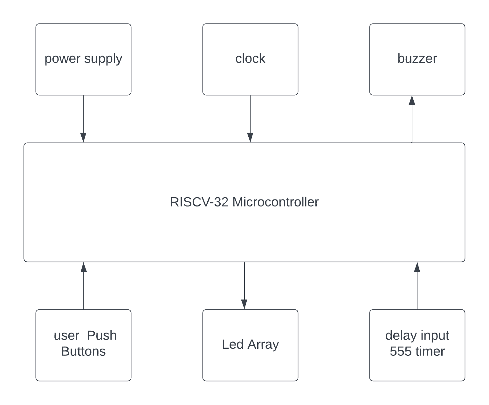

# RISCV_ASIC_2_player_arcade_game

### RISCV GNU tool chain

RISCV GNU tool chain is a C & C++ cross compiler. It has two modes: ELF/Newlib toolchain and Linux-ELF/glibc toolchain. We are using ELF/Newlib toolchain.

We are building a custom RISCV based application core for a specific application for 32 bit processor. 

Following are tools required to compile & execute the application:

1. RISCV GNU toolchain with dependent libraries as specified in [RISCV-GNU-Toolchain](https://github.com/riscv-collab/riscv-gnu-toolchain).

2. Spike simulator - Spike is a functional RISC-V ISA simulator that implements a functional model of one or more RISC-V harts. [RISCV-SPIKE](https://github.com/riscv-software-src/riscv-isa-sim.git).

### RISCV 32 bit compiler installation.

```
sudo apt install libc6-dev
git clone https://github.com/riscv/riscv-gnu-toolchain --recursive
mkdir riscv32-toolchain
cd riscv-gnu-toolchain
./configure --prefix=/home/ammula-shiva-kumar/riscv32-toolchain/ --with-arch=rv32i --with-abi=ilp32
sudo apt-get install libgmp-dev
make
```

Access the riscv32-unknown-elf-gcc inside bin folder of riscv32-toolchain folder in home folder of user as shown.

```
/home/ammula-shiva-kumar/riscv32-toolchain/bin/riscv32-unknown-elf-gcc --version

```

### 2 Player Arcade Game


**Description**
2 Player Arcade game is a physically interactive fun game where people will play very enthusiastically. here as shown in the above figure the game contains "10x5" led matrix and two push buttions where each user uses a push button to continuously press to increase the number of led's of the user colour.when the green and the red leds meet they collide and the upper hand here between the two colours is the  user colour that came in first. Finally the user who has more rate of pressing the push button, will have all the leds lit up with the user colour and the user wins. There will be a buzzer sound to indicate that the game has ended and the new game has started

### Block Diagram



### Functionality -

- In this architecture the microcontroller samples the user input on every loop and checks weather the user input status(pressed or released) is changed or not . 1 will be transmitted if button is pressed and 0 is transmitted if button is released.
- In the middle of the loop if the status of the button changes from '0' to '1' then led count value of that particular user is incremented.
- If the push bution status stays constant then no change is done on the led count variables.
- Here a variable incr_en is used to signify that the push buttion status is changed and you can increment the user count variable.
- The above mentioned logic is mandatory to ensure that every time user presses the key once only one led is incremented.
- When both leds collide led count variables are incremented or decremented based on which user input is given respectively.
- here led counts are initialised with 0 and 51 for user 1 and 2 respectively.
- if user 1 presses the button then count 1 is incremented and if user 2 presses the key then count 2 is decremented .
- the user with all the leds as the same user colour wins.
- A buzzer sound is provided which beeps three times with a second delay each to indicate that the previous game has ended and new game starts after the 3 beeps so users should get ready to play in the mean time.
  
### Flow Chart


here each time the led count variable is incremented/decremented it checks weather count2 > 0 and count1 <51 and increments/decrements the count variable.If any condition is not satisified then the user wins and the buzzer function is called.the buzzer function uses the delay input from the 555 timer to make 1 second delay with counter and turns on the buzzeer 3 times with a second delay in middle. after beeping 3 times it initialises the count variables again and returns the function to main.

### code

```
//#include<stdio.h>

unsigned int input_key(unsigned int key);
void buzzer(unsigned int state);
void delay(unsigned int delay_ms);
void display(unsigned int count_1, unsigned int count_2);

int main(void)
{
	unsigned int incr1_en = 1 ;
	unsigned int incr2_en = 1 ;
	unsigned int key_1, key_2 ;
	unsigned int count_1 = 0 ;
	unsigned int count_2 = 51 ;


	while(1)
	{

		//printf("enter user keys\n ") ;          //used for debugging in windows
		//scanf("%d",&key_1);
		//scanf("%d",&key_2);
		key_1 = input_key(1);
		key_2 = input_key(2);

	
		if((key_1 > 0)&&(key_2 > 0))
		{
			if((incr1_en ==1)&&(incr2_en == 1))
			{
				if((count_2 - count_1)>1)
				{
					count_2 = count_2 - 1 ;
					incr2_en = 0 ;
					count_1 = count_1 + 1 ;
					incr1_en = 0 ;
				}
				else
				{
					incr1_en = 0 ;
					incr2_en = 0 ;
				}
			}
			else if((incr1_en ==0)&&(incr2_en == 1))
			{
				if((count_2 - count_1)>1)
				{
					count_2 = count_2 - 1 ;
					incr2_en = 0 ;
				}
				else
				{
					count_2 = count_2 - 1 ;
                    incr2_en = 0 ;
					count_1 = count_1 - 1 ;
				}
			}
			else if((incr1_en ==1)&&(incr2_en == 0))
			{
				if((count_2 - count_1)>1)
				{
					count_1 = count_1 +1 ;
					incr1_en = 0 ;
				}
				else
				{
					count_1 = count_1 + 1 ;
					incr1_en = 0 ;
					count_2 = count_2 + 1 ;
				}
			}
			

	
		}
		else if((key_1 > 0)&&(key_2==0))
		{
			incr2_en = 1 ;
			if(incr1_en)
			{
	        	if((count_2 - count_1)>1)
                {
                    count_1 = count_1 +1 ;
                    incr1_en = 0 ;
            	}
          	  	else
           		{
        	       	count_1 = count_1 + 1 ;
                	incr1_en = 0 ;
                 	count_2 = count_2 + 1 ;
            	}
			}	


		}
		else if((key_1==0)&&(key_2 > 0))
		{
			incr1_en = 1 ;
			if(incr2_en)
        	{
                if((count_2 - count_1)>1)
                {
        	        count_2 = count_2 - 1 ;
    	   	        incr2_en = 0 ;
          		}
            	else
          		{
                	count_2 = count_2 - 1 ;
                  	incr2_en = 0 ;
                  	count_1 = count_1 - 1 ;
               	}
        	}

		}
		else
		{
			incr1_en = 1 ;
			incr2_en = 1 ;
		}
		if((count_1 > 50) | (count_2 < 1) )
		{   buzzer(1);          //first beep indicates the game is ended the leds get halted for 1.5 sec. and resetted to 0
			delay(500);
			buzzer(0);
			delay(1000);
			count_1 = 0 ;
			count_2 = 51 ;
			display(count_1, count_2);

			buzzer(1);          //beep sound for 3 times for every 1 sec.
			delay(400);
			buzzer(0);
			delay(600);

			buzzer(1);
			delay(400);
			buzzer(0);
			delay(600);

			buzzer(1);
			delay(400);
			buzzer(0);
			delay(600);


		}
		display(count_1, count_2) ;          //after every iteration the display is updated.
      	//printf("count_1 = %d ,count_2 = %d \n ", count_1, count_2 ) ;           // used for debugging in windows

	}
	return (0);
	
}

unsigned int input_key(unsigned int key)
{
	 int temp = key*16;               //key_1 = bit-4 , key_2 = bit-5
            asm(
			"addi x29,x30,0\n"          // copy x30 to x29
            "and %0,x29, %1\n\t"     // take the key value from specified bit
            :"=r"(key)
            :"r"(temp)
        );
		return temp;
}

void buzzer(unsigned int state)
{
	int temp = state *4 ;    //buzzer output 2nd bit of x30 reg.
		asm(
			"or x30 , x30, %0"
			:  :"r"(temp)
		);
}

void delay(unsigned int delay_ms)
{
	int counter = 0;
	int timer_inp ;             //555 timer input bit 6 of x30
	int temp = 0 ;
	while(1)
	{
		asm(
			"addi x29, x30, 0\n"
			"and %0 , x29, 64"
			:"=r"(timer_inp)
		);

		if(temp != timer_inp)
		{
			temp = timer_inp;
			counter = counter +1 ;
		}
		if(delay_ms == counter)
		{
			break;
		}
	}
}

void display(unsigned int count_1, unsigned int count_2)
{

        int temp1 = count_1 * 1048576  ;    // display output bit-25 to bit-21 , 6-bits of x30 reg.
        int temp2 = count_2 * 67108864 ;    //  display output bit-31 to bit-26 , 6-bits of x30 reg.
		asm(
                        "or x30 , x30 , %1 \n "
			"or x30 , x30, %0 \n"
			:  :"r"(temp1), "r"(temp2)
		);

	
}  


```
### Assembly Code

```

arcade2.o:     file format elf32-littleriscv


Disassembly of section .text:

00010074 <main>:
   10074:	fd010113          	add	sp,sp,-48
   10078:	02112623          	sw	ra,44(sp)
   1007c:	02812423          	sw	s0,40(sp)
   10080:	03010413          	add	s0,sp,48
   10084:	00100793          	li	a5,1
   10088:	fef42623          	sw	a5,-20(s0)
   1008c:	00100793          	li	a5,1
   10090:	fef42423          	sw	a5,-24(s0)
   10094:	fe042223          	sw	zero,-28(s0)
   10098:	03300793          	li	a5,51
   1009c:	fef42023          	sw	a5,-32(s0)
   100a0:	00100513          	li	a0,1
   100a4:	2f4000ef          	jal	10398 <input_key>
   100a8:	fca42e23          	sw	a0,-36(s0)
   100ac:	00200513          	li	a0,2
   100b0:	2e8000ef          	jal	10398 <input_key>
   100b4:	fca42c23          	sw	a0,-40(s0)
   100b8:	fdc42783          	lw	a5,-36(s0)
   100bc:	12078263          	beqz	a5,101e0 <main+0x16c>
   100c0:	fd842783          	lw	a5,-40(s0)
   100c4:	10078e63          	beqz	a5,101e0 <main+0x16c>
   100c8:	fec42703          	lw	a4,-20(s0)
   100cc:	00100793          	li	a5,1
   100d0:	04f71a63          	bne	a4,a5,10124 <main+0xb0>
   100d4:	fe842703          	lw	a4,-24(s0)
   100d8:	00100793          	li	a5,1
   100dc:	04f71463          	bne	a4,a5,10124 <main+0xb0>
   100e0:	fe042703          	lw	a4,-32(s0)
   100e4:	fe442783          	lw	a5,-28(s0)
   100e8:	40f70733          	sub	a4,a4,a5
   100ec:	00100793          	li	a5,1
   100f0:	02e7f463          	bgeu	a5,a4,10118 <main+0xa4>
   100f4:	fe042783          	lw	a5,-32(s0)
   100f8:	fff78793          	add	a5,a5,-1
   100fc:	fef42023          	sw	a5,-32(s0)
   10100:	fe042423          	sw	zero,-24(s0)
   10104:	fe442783          	lw	a5,-28(s0)
   10108:	00178793          	add	a5,a5,1
   1010c:	fef42223          	sw	a5,-28(s0)
   10110:	fe042623          	sw	zero,-20(s0)
   10114:	0c80006f          	j	101dc <main+0x168>
   10118:	fe042623          	sw	zero,-20(s0)
   1011c:	fe042423          	sw	zero,-24(s0)
   10120:	0bc0006f          	j	101dc <main+0x168>
   10124:	fec42783          	lw	a5,-20(s0)
   10128:	04079c63          	bnez	a5,10180 <main+0x10c>
   1012c:	fe842703          	lw	a4,-24(s0)
   10130:	00100793          	li	a5,1
   10134:	04f71663          	bne	a4,a5,10180 <main+0x10c>
   10138:	fe042703          	lw	a4,-32(s0)
   1013c:	fe442783          	lw	a5,-28(s0)
   10140:	40f70733          	sub	a4,a4,a5
   10144:	00100793          	li	a5,1
   10148:	00e7fc63          	bgeu	a5,a4,10160 <main+0xec>
   1014c:	fe042783          	lw	a5,-32(s0)
   10150:	fff78793          	add	a5,a5,-1
   10154:	fef42023          	sw	a5,-32(s0)
   10158:	fe042423          	sw	zero,-24(s0)
   1015c:	0800006f          	j	101dc <main+0x168>
   10160:	fe042783          	lw	a5,-32(s0)
   10164:	fff78793          	add	a5,a5,-1
   10168:	fef42023          	sw	a5,-32(s0)
   1016c:	fe042423          	sw	zero,-24(s0)
   10170:	fe442783          	lw	a5,-28(s0)
   10174:	fff78793          	add	a5,a5,-1
   10178:	fef42223          	sw	a5,-28(s0)
   1017c:	0600006f          	j	101dc <main+0x168>
   10180:	fec42703          	lw	a4,-20(s0)
   10184:	00100793          	li	a5,1
   10188:	12f71e63          	bne	a4,a5,102c4 <main+0x250>
   1018c:	fe842783          	lw	a5,-24(s0)
   10190:	12079a63          	bnez	a5,102c4 <main+0x250>
   10194:	fe042703          	lw	a4,-32(s0)
   10198:	fe442783          	lw	a5,-28(s0)
   1019c:	40f70733          	sub	a4,a4,a5
   101a0:	00100793          	li	a5,1
   101a4:	00e7fc63          	bgeu	a5,a4,101bc <main+0x148>
   101a8:	fe442783          	lw	a5,-28(s0)
   101ac:	00178793          	add	a5,a5,1
   101b0:	fef42223          	sw	a5,-28(s0)
   101b4:	fe042623          	sw	zero,-20(s0)
   101b8:	10c0006f          	j	102c4 <main+0x250>
   101bc:	fe442783          	lw	a5,-28(s0)
   101c0:	00178793          	add	a5,a5,1
   101c4:	fef42223          	sw	a5,-28(s0)
   101c8:	fe042623          	sw	zero,-20(s0)
   101cc:	fe042783          	lw	a5,-32(s0)
   101d0:	00178793          	add	a5,a5,1
   101d4:	fef42023          	sw	a5,-32(s0)
   101d8:	0ec0006f          	j	102c4 <main+0x250>
   101dc:	0e80006f          	j	102c4 <main+0x250>
   101e0:	fdc42783          	lw	a5,-36(s0)
   101e4:	06078263          	beqz	a5,10248 <main+0x1d4>
   101e8:	fd842783          	lw	a5,-40(s0)
   101ec:	04079e63          	bnez	a5,10248 <main+0x1d4>
   101f0:	00100793          	li	a5,1
   101f4:	fef42423          	sw	a5,-24(s0)
   101f8:	fec42783          	lw	a5,-20(s0)
   101fc:	0c078663          	beqz	a5,102c8 <main+0x254>
   10200:	fe042703          	lw	a4,-32(s0)
   10204:	fe442783          	lw	a5,-28(s0)
   10208:	40f70733          	sub	a4,a4,a5
   1020c:	00100793          	li	a5,1
   10210:	00e7fc63          	bgeu	a5,a4,10228 <main+0x1b4>
   10214:	fe442783          	lw	a5,-28(s0)
   10218:	00178793          	add	a5,a5,1
   1021c:	fef42223          	sw	a5,-28(s0)
   10220:	fe042623          	sw	zero,-20(s0)
   10224:	0a40006f          	j	102c8 <main+0x254>
   10228:	fe442783          	lw	a5,-28(s0)
   1022c:	00178793          	add	a5,a5,1
   10230:	fef42223          	sw	a5,-28(s0)
   10234:	fe042623          	sw	zero,-20(s0)
   10238:	fe042783          	lw	a5,-32(s0)
   1023c:	00178793          	add	a5,a5,1
   10240:	fef42023          	sw	a5,-32(s0)
   10244:	0840006f          	j	102c8 <main+0x254>
   10248:	fdc42783          	lw	a5,-36(s0)
   1024c:	06079263          	bnez	a5,102b0 <main+0x23c>
   10250:	fd842783          	lw	a5,-40(s0)
   10254:	04078e63          	beqz	a5,102b0 <main+0x23c>
   10258:	00100793          	li	a5,1
   1025c:	fef42623          	sw	a5,-20(s0)
   10260:	fe842783          	lw	a5,-24(s0)
   10264:	06078263          	beqz	a5,102c8 <main+0x254>
   10268:	fe042703          	lw	a4,-32(s0)
   1026c:	fe442783          	lw	a5,-28(s0)
   10270:	40f70733          	sub	a4,a4,a5
   10274:	00100793          	li	a5,1
   10278:	00e7fc63          	bgeu	a5,a4,10290 <main+0x21c>
   1027c:	fe042783          	lw	a5,-32(s0)
   10280:	fff78793          	add	a5,a5,-1
   10284:	fef42023          	sw	a5,-32(s0)
   10288:	fe042423          	sw	zero,-24(s0)
   1028c:	03c0006f          	j	102c8 <main+0x254>
   10290:	fe042783          	lw	a5,-32(s0)
   10294:	fff78793          	add	a5,a5,-1
   10298:	fef42023          	sw	a5,-32(s0)
   1029c:	fe042423          	sw	zero,-24(s0)
   102a0:	fe442783          	lw	a5,-28(s0)
   102a4:	fff78793          	add	a5,a5,-1
   102a8:	fef42223          	sw	a5,-28(s0)
   102ac:	01c0006f          	j	102c8 <main+0x254>
   102b0:	00100793          	li	a5,1
   102b4:	fef42623          	sw	a5,-20(s0)
   102b8:	00100793          	li	a5,1
   102bc:	fef42423          	sw	a5,-24(s0)
   102c0:	0080006f          	j	102c8 <main+0x254>
   102c4:	00000013          	nop
   102c8:	fe442783          	lw	a5,-28(s0)
   102cc:	0337b793          	sltiu	a5,a5,51
   102d0:	0017c793          	xor	a5,a5,1
   102d4:	0ff7f713          	zext.b	a4,a5
   102d8:	fe042783          	lw	a5,-32(s0)
   102dc:	0017b793          	seqz	a5,a5
   102e0:	0ff7f793          	zext.b	a5,a5
   102e4:	00f767b3          	or	a5,a4,a5
   102e8:	0ff7f793          	zext.b	a5,a5
   102ec:	08078e63          	beqz	a5,10388 <main+0x314>
   102f0:	00100513          	li	a0,1
   102f4:	0e4000ef          	jal	103d8 <buzzer>
   102f8:	1f400513          	li	a0,500
   102fc:	110000ef          	jal	1040c <delay>
   10300:	00000513          	li	a0,0
   10304:	0d4000ef          	jal	103d8 <buzzer>
   10308:	3e800513          	li	a0,1000
   1030c:	100000ef          	jal	1040c <delay>
   10310:	fe042223          	sw	zero,-28(s0)
   10314:	03300793          	li	a5,51
   10318:	fef42023          	sw	a5,-32(s0)
   1031c:	fe042583          	lw	a1,-32(s0)
   10320:	fe442503          	lw	a0,-28(s0)
   10324:	150000ef          	jal	10474 <display>
   10328:	00100513          	li	a0,1
   1032c:	0ac000ef          	jal	103d8 <buzzer>
   10330:	19000513          	li	a0,400
   10334:	0d8000ef          	jal	1040c <delay>
   10338:	00000513          	li	a0,0
   1033c:	09c000ef          	jal	103d8 <buzzer>
   10340:	25800513          	li	a0,600
   10344:	0c8000ef          	jal	1040c <delay>
   10348:	00100513          	li	a0,1
   1034c:	08c000ef          	jal	103d8 <buzzer>
   10350:	19000513          	li	a0,400
   10354:	0b8000ef          	jal	1040c <delay>
   10358:	00000513          	li	a0,0
   1035c:	07c000ef          	jal	103d8 <buzzer>
   10360:	25800513          	li	a0,600
   10364:	0a8000ef          	jal	1040c <delay>
   10368:	00100513          	li	a0,1
   1036c:	06c000ef          	jal	103d8 <buzzer>
   10370:	19000513          	li	a0,400
   10374:	098000ef          	jal	1040c <delay>
   10378:	00000513          	li	a0,0
   1037c:	05c000ef          	jal	103d8 <buzzer>
   10380:	25800513          	li	a0,600
   10384:	088000ef          	jal	1040c <delay>
   10388:	fe042583          	lw	a1,-32(s0)
   1038c:	fe442503          	lw	a0,-28(s0)
   10390:	0e4000ef          	jal	10474 <display>
   10394:	d0dff06f          	j	100a0 <main+0x2c>

00010398 <input_key>:
   10398:	fd010113          	add	sp,sp,-48
   1039c:	02812623          	sw	s0,44(sp)
   103a0:	03010413          	add	s0,sp,48
   103a4:	fca42e23          	sw	a0,-36(s0)
   103a8:	fdc42783          	lw	a5,-36(s0)
   103ac:	00479793          	sll	a5,a5,0x4
   103b0:	fef42623          	sw	a5,-20(s0)
   103b4:	fec42783          	lw	a5,-20(s0)
   103b8:	000f0e93          	mv	t4,t5
   103bc:	00fef7b3          	and	a5,t4,a5
   103c0:	fcf42e23          	sw	a5,-36(s0)
   103c4:	fec42783          	lw	a5,-20(s0)
   103c8:	00078513          	mv	a0,a5
   103cc:	02c12403          	lw	s0,44(sp)
   103d0:	03010113          	add	sp,sp,48
   103d4:	00008067          	ret

000103d8 <buzzer>:
   103d8:	fd010113          	add	sp,sp,-48
   103dc:	02812623          	sw	s0,44(sp)
   103e0:	03010413          	add	s0,sp,48
   103e4:	fca42e23          	sw	a0,-36(s0)
   103e8:	fdc42783          	lw	a5,-36(s0)
   103ec:	00279793          	sll	a5,a5,0x2
   103f0:	fef42623          	sw	a5,-20(s0)
   103f4:	fec42783          	lw	a5,-20(s0)
   103f8:	00ff6f33          	or	t5,t5,a5
   103fc:	00000013          	nop
   10400:	02c12403          	lw	s0,44(sp)
   10404:	03010113          	add	sp,sp,48
   10408:	00008067          	ret

0001040c <delay>:
   1040c:	fd010113          	add	sp,sp,-48
   10410:	02812623          	sw	s0,44(sp)
   10414:	03010413          	add	s0,sp,48
   10418:	fca42e23          	sw	a0,-36(s0)
   1041c:	fe042623          	sw	zero,-20(s0)
   10420:	fe042423          	sw	zero,-24(s0)
   10424:	000f0e93          	mv	t4,t5
   10428:	040ef793          	and	a5,t4,64
   1042c:	fef42223          	sw	a5,-28(s0)
   10430:	fe842703          	lw	a4,-24(s0)
   10434:	fe442783          	lw	a5,-28(s0)
   10438:	00f70c63          	beq	a4,a5,10450 <delay+0x44>
   1043c:	fe442783          	lw	a5,-28(s0)
   10440:	fef42423          	sw	a5,-24(s0)
   10444:	fec42783          	lw	a5,-20(s0)
   10448:	00178793          	add	a5,a5,1
   1044c:	fef42623          	sw	a5,-20(s0)
   10450:	fec42783          	lw	a5,-20(s0)
   10454:	fdc42703          	lw	a4,-36(s0)
   10458:	00f70463          	beq	a4,a5,10460 <delay+0x54>
   1045c:	fc9ff06f          	j	10424 <delay+0x18>
   10460:	00000013          	nop
   10464:	00000013          	nop
   10468:	02c12403          	lw	s0,44(sp)
   1046c:	03010113          	add	sp,sp,48
   10470:	00008067          	ret

00010474 <display>:
   10474:	fd010113          	add	sp,sp,-48
   10478:	02812623          	sw	s0,44(sp)
   1047c:	03010413          	add	s0,sp,48
   10480:	fca42e23          	sw	a0,-36(s0)
   10484:	fcb42c23          	sw	a1,-40(s0)
   10488:	fdc42783          	lw	a5,-36(s0)
   1048c:	01479793          	sll	a5,a5,0x14
   10490:	fef42623          	sw	a5,-20(s0)
   10494:	fd842783          	lw	a5,-40(s0)
   10498:	01a79793          	sll	a5,a5,0x1a
   1049c:	fef42423          	sw	a5,-24(s0)
   104a0:	fec42783          	lw	a5,-20(s0)
   104a4:	fe842703          	lw	a4,-24(s0)
   104a8:	00ef6f33          	or	t5,t5,a4
   104ac:	00ff6f33          	or	t5,t5,a5
   104b0:	00000013          	nop
   104b4:	02c12403          	lw	s0,44(sp)
   104b8:	03010113          	add	sp,sp,48
   104bc:	00008067          	ret


```

### different instruction in assembly code

```
Number of different instructions: 22
List of unique instructions:
beq
bne
nop
ret
mv
zext.b
seqz
sub
sw
add
sll
lw
or
and
bnez
li
j
xor
beqz
sltiu
jal
bgeu

```
